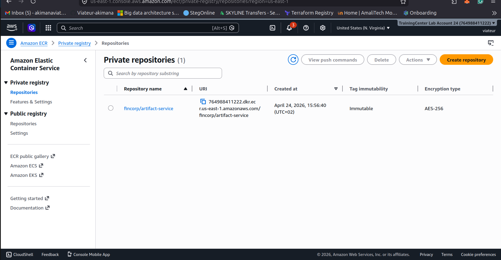

# FinCorp – Secure Software Supply Chain & Disaster Recovery

This repository implements FinCorp's secure, auditable software supply chain and cross-region disaster recovery plan, satisfying the following objectives:

| Objective | Implementation |
|-----------|---------------|
| Immutable artifact pipeline | GitHub Actions Trivy scan ECR (tag-immutable, scan-on-push) |
| Secure package registry | AWS CodeArtifact proxying public npm and PyPI |
| Build fails on HIGH/CRITICAL CVEs | Trivy `exit-code: 1` + ECR scan gate |
| RDS in us-east-1 | Terraform `modules/rds`, Multi-AZ, encrypted |
| Daily cross-region backups | AWS Backup plan with `cron(0 2 * * ? *)` + copy to us-west-2 |
| DR failover within 30 minutes | `scripts/dr-restore.sh` with RTO tracking |

---

## Repository Layout

```
.
 app/ # Node.js sample application
 Dockerfile # Multi-stage, non-root, CodeArtifact-aware
 package.json
 src/
 .github/workflows/
 ci-cd.yml # Full secure CI/CD pipeline
 dr-test.yml # DR simulation & recovery workflow
 infrastructure/terraform/
 main.tf # Root module – wires everything together
 variables.tf
 outputs.tf
 modules/
 ecr/ # ECR repo – tag immutability, scan-on-push
 codeartifact/ # CodeArtifact domain + npm/pip repos
 rds/ # RDS PostgreSQL 15, Multi-AZ, encrypted
 backup/ # AWS Backup plan + cross-region copy
 iam/ # GitHub Actions OIDC role
 scripts/
 setup-codeartifact.sh # Configure npm/pip to use CodeArtifact
 check-ecr-vulnerabilities.sh # Gate: fail on HIGH/CRITICAL
 dr-simulate-failure.sh # Delete primary DB (DR drill)
 dr-restore.sh # Restore DB in us-west-2 within 30 min
 dr-validate.sh # Validate restored DB health
 docs/
 architecture.md # System architecture & design decisions
 pipeline.md # CI/CD pipeline detailed walkthrough
 disaster-recovery.md # DR plan, RTO/RPO, step-by-step recovery
 runbooks/
 dr-failover.md # On-call DR failover runbook
 vulnerability-response.md # CVE response playbook
```

---

## Prerequisites

| Tool | Version |
|------|---------|
| Terraform | ≥ 1.5 |
| AWS CLI | ≥ 2.13 |
| Docker | ≥ 24 |
| Node.js | ≥ 18 |

---

## Quick Start

### 1 – Bootstrap Infrastructure

```bash
cd infrastructure/terraform

# Copy and fill in your values
cp terraform.tfvars.example terraform.tfvars

# Initialise and apply
terraform init
terraform plan -out=tfplan
terraform apply tfplan
```

### 2 – Configure GitHub Secrets

Only 3 secrets are required. Networking, passwords, and DB identifiers are provisioned
automatically by Terraform and stored in SSM Parameter Store.

| Secret | Description |
|--------|-------------|
| `AWS_CICD_ROLE_ARN` | ARN of the OIDC role (`terraform output cicd_role_arn`) |
| `AWS_ACCOUNT_ID` | 12-digit AWS account ID |
| `DB_USERNAME` | RDS master username (password is managed by AWS Secrets Manager) |

> **Removed secrets** — no longer needed after Terraform provisions infrastructure:
> `DB_PASSWORD`, `PRIMARY_VPC_ID`, `PRIMARY_SUBNET_IDS`, `PRIMARY_DB_IDENTIFIER`,
> `DR_VPC_ID`, `DR_SUBNET_GROUP`, `DR_SECURITY_GROUP`, `DR_KMS_KEY_ARN`

### 3 – Trigger a Pipeline Run

Push to `main` or open a pull request. The pipeline will:
1. Scan for committed secrets (Gitleaks)
2. Install deps from CodeArtifact
3. Run unit tests
4. Build the Docker image (base image digest-pinned)
5. Run Trivy scan – **fails** if HIGH/CRITICAL CVEs found
6. Push the immutable-tagged image to ECR
7. Wait for ECR's own scan and gate on results
8. Sign the image with Cosign (keyless OIDC)
9. Generate an SBOM

### 4 – Run a DR Drill

Go to **Actions DR Simulation & Recovery Test Run workflow**, choose `restore-from-backup`, and type `CONFIRM`.

---

## Security Controls Summary

- **Tag Immutability**: ECR `imageTagMutability = IMMUTABLE` prevents overwriting a released tag.
- **Dual-layer Scan**: Trivy (pre-push, exit-code 1) + ECR Enhanced Scanning (post-push) both gate on HIGH/CRITICAL.
- **Secret Scanning**: Gitleaks scans every push and PR before any AWS job runs.
- **Image Signing**: Cosign keyless signing ties every pushed image to its GitHub Actions run via OIDC.
- **Digest-pinned Base Image**: All Dockerfile `FROM` stages use `sha256` digest — no mutable tags.
- **Least-Privilege OIDC**: No long-lived AWS keys; all pipeline jobs assume a scoped role via OIDC.
- **KMS Encryption**: RDS, backups, CodeArtifact, and CloudTrail all use customer-managed KMS keys with rotation.
- **Secrets Manager**: RDS master password is generated and auto-rotated by AWS — never stored in GitHub Secrets or Terraform state.
- **CloudTrail**: Multi-region audit trail captures all API calls to an encrypted, version-enabled S3 bucket.
- **Vault Lock**: AWS Backup WORM lock prevents backup deletion (satisfies SEC 17a-4).
- **SSL Enforced**: `rds.force_ssl = 1` parameter blocks unencrypted DB connections.
- **Auto-provisioned Networking**: VPC, subnets, SGs, and KMS keys created by Terraform in both regions — no manual secrets needed.
- **Audit Logging**: RDS CloudWatch log exports (postgresql, upgrade) and ECR API CloudTrail.

---

## Compliance Notes

All infrastructure is tagged with `Project`, `Environment`, and `ManagedBy` for cost allocation and compliance reporting. The backup vault lock satisfies SEC 17a-4 WORM requirements for financial records.

---

## Screenshots

### Terraform Infrastructure Apply



### AWS CodeArtifact – npm Packages Cached


### Amazon ECR – Images with Immutable Tags


### ECR Scan – node:18 Image (1 CRITICAL + 11 HIGH Blocked)


### ECR Scan – node:22 Image (0 Findings – Pipeline Passes)


### AWS Backup – Primary Vault (us-east-1)


### AWS Backup – DR Vault Recovery Point (us-west-2)


### RDS Primary Instance Deleted (Simulated Region Failure)


### DR Restore – fincorp-dr-restored Available in us-west-2


### GitHub Actions – CI/CD Pipeline Run


